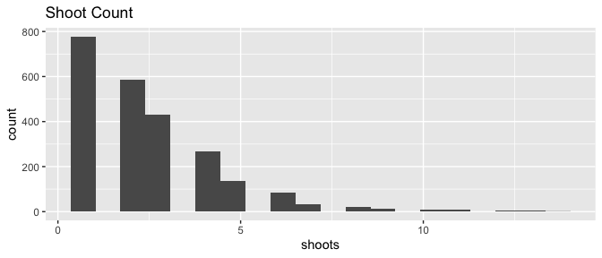
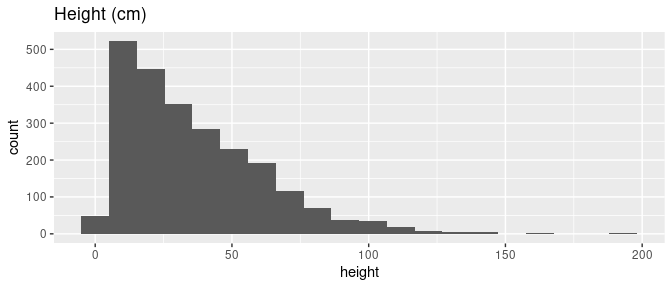
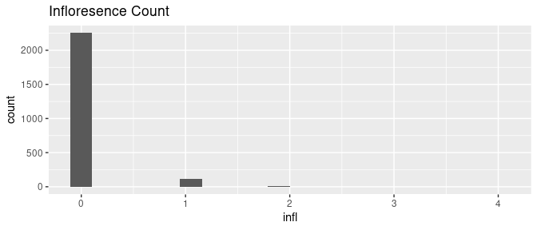

# GitHub Actions For Research
Eric Scott

TODO: explain what this is

## Example Report

One example workflow involves re-rendering this README to include some
updated histograms of the example dataset in `data/heliconia_sample.csv`

